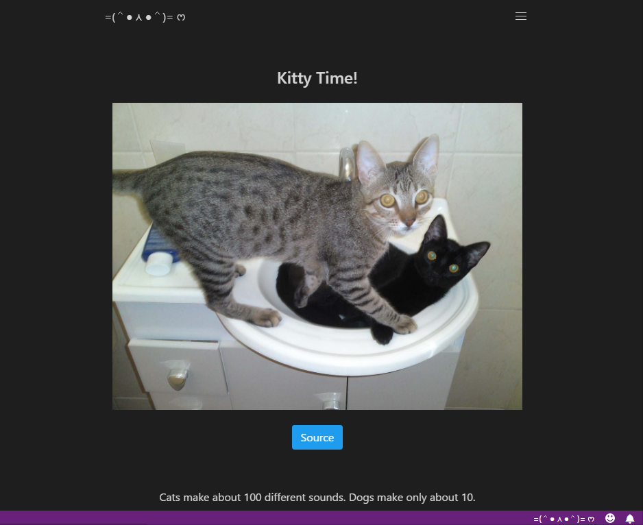
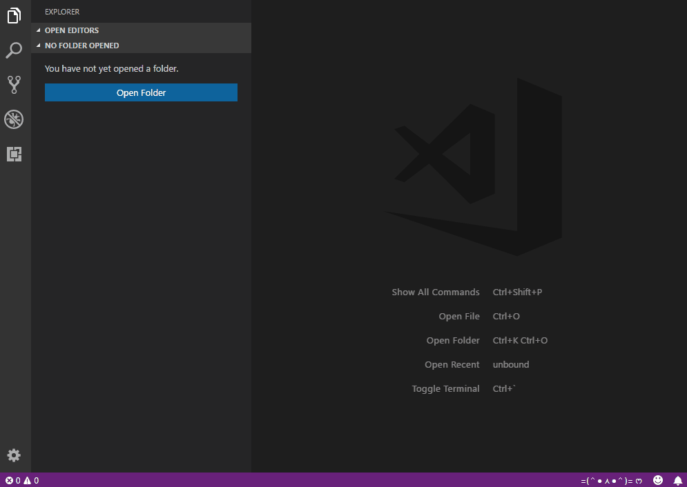

# Kitty Time =(＾● ⋏ ●＾)= ෆ
> Stressed after coding for hours? Need a break? Perhaps an inspiration? Something to calm your nerves after almost pushing that fatal git commit?  
> It's Kitty Time! =(＾● ⋏ ●＾)= ෆ"

[](https://marketplace.visualstudio.com/items?itemName=QzSG.kitty-time)
[](https://marketplace.visualstudio.com/items?itemName=QzSG.kitty-time)
[](https://marketplace.visualstudio.com/items?itemName=QzSG.kitty-time#review-details)

## Features


Cats , Cats , and Cats

## Now Includes Cat Facts!
> Get a cool cat fact in the footer everytime!




## How to get them cats. 
> Cats appear at random, the same cat appearing below is just a huge coincidence 😜

### The Kitty Button



### I am Code Kitty Command


## Requirements

A 💖 full of 🐱 is required. 

## Extension Settings

This extension contributes the following settings:

* `kittyTime.apiKey`: Get api key from https://thecatapi.com/api-key-registration.html, unlocks more cats, `cats++`;
* `kittyTime.imageType`: Image Type to show (Static / Animated / Both), defaults to Animated. 

Example:
```json
"kittyTime.apiKey" : "{Api Key Here}",
"kittyTime.imageType" : "Animated"
```
## Known Issues

Developers have been caught spending more time looking at cats and kittens instead of focusing time on actual development

## Release Notes

### 0.0.1

Development release of Kitty Time

-----------------------------------------------------------------------------------------------------------

### 0.0.8

- Improve Readme
- Change API to secure `https` endpoint
- Bug Fixes (Cats got them all)

-----------------------------------------------------------------------------------------------------------

### 0.1.0

- Added Cat Facts in footer
- Some Bug Fixes (Cats got them again)

-----------------------------------------------------------------------------------------------------------

### 0.2.0

- Use local stylesheets (Kitty now runs slightly faster)

-----------------------------------------------------------------------------------------------------------

### 0.2.2

- Update VsCode engine version

-----------------------------------------------------------------------------------------------------------

### 0.3.0
- Update packages
- Fix broken theme detection to automatically set background and font colors according to user existing theme

-----------------------------------------------------------------------------------------------------------

### 0.3.1
- Update packages
    - Axios

-----------------------------------------------------------------------------------------------------------

### 0.3.3
- Update packages

-----------------------------------------------------------------------------------------------------------

### 0.4.1
- Update packages

-----------------------------------------------------------------------------------------------------------

### 0.4.2
- Update LICENSE

-----------------------------------------------------------------------------------------------------------

### 0.4.3
- Update Axios

-----------------------------------------------------------------------------------------------------------

### 0.4.4
- Update package.json

-----------------------------------------------------------------------------------------------------------


## Acknowledgments

* [Cat Api](https://thecatapi.com)
* [Cat Facts](https://catfact.ninja/)

## License

Copyright (c) QzSG - Released under the [MIT license](LICENSE).

**Enjoy!**
